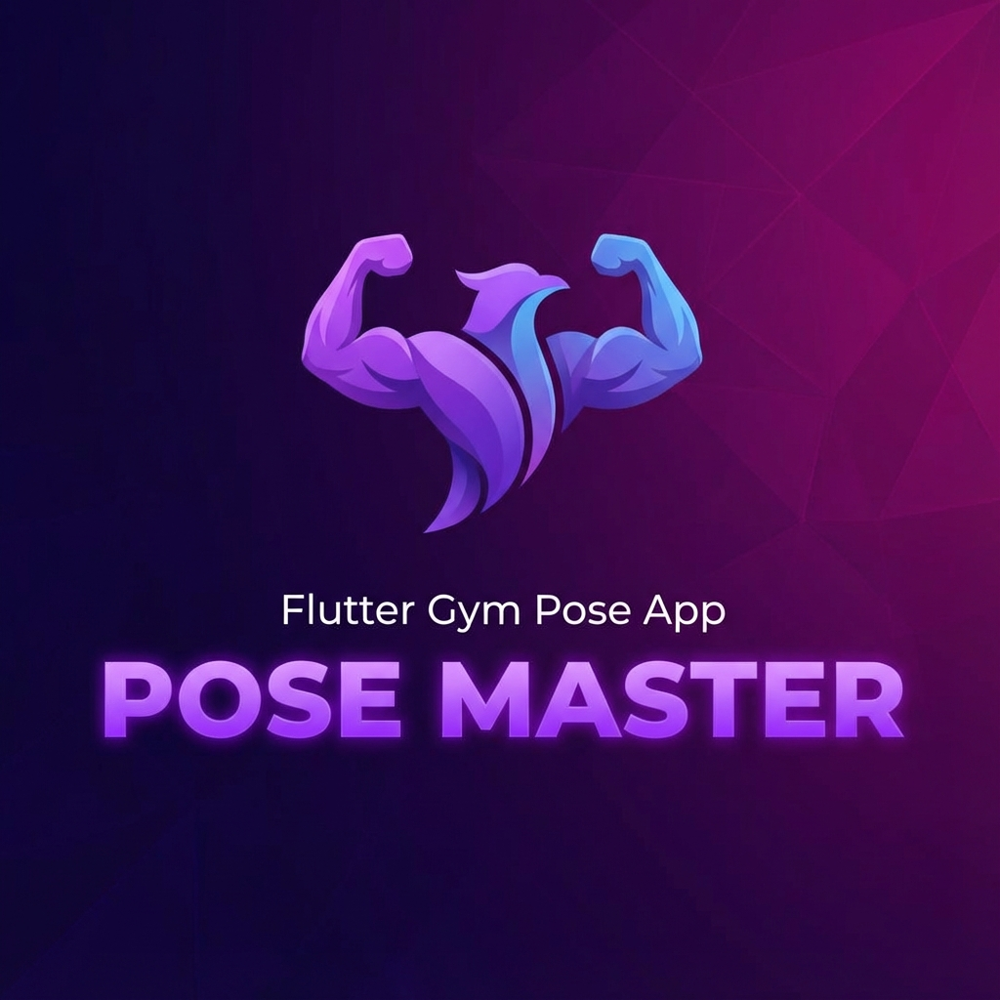

# Gym Pose App

A Flutter application for real-time gym workout rep counting using ML Kit Pose Detection.



## Features
- Real-time pose detection.
- Squat rep counting.
- Visual overlay of body landmarks.
- Support for multiple exercises (pushup, lunge, jumping jack, crunch, deadlift, plank, overhead press, high knees).

## Getting Started

1. **Install Dependencies**:
   ```bash
   flutter pub get
   ```

2. **Run the App**:
   Connect a physical device (iOS or Android) and run:
   ```bash
   flutter run
   ```

## Requirements
- **Android**: Min SDK 21
- **iOS**: iOS 11.0+ (Camera usage description added to Info.plist)

## Troubleshooting
- If the camera preview is rotated, check `lib/views/camera_view.dart` and adjust `InputImageRotation` or `DeviceOrientation`.
- Ensure you have granted Camera permissions.
